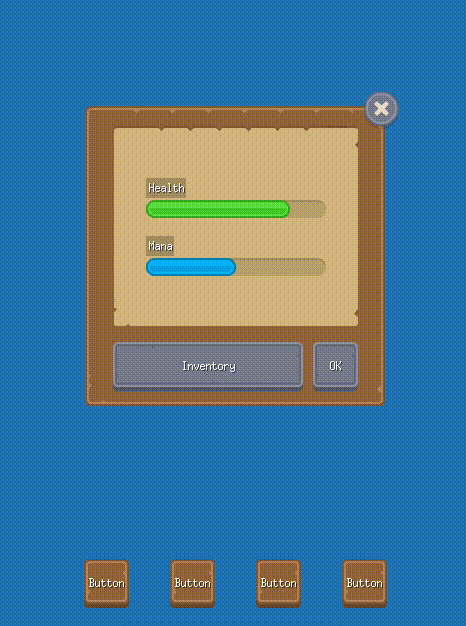
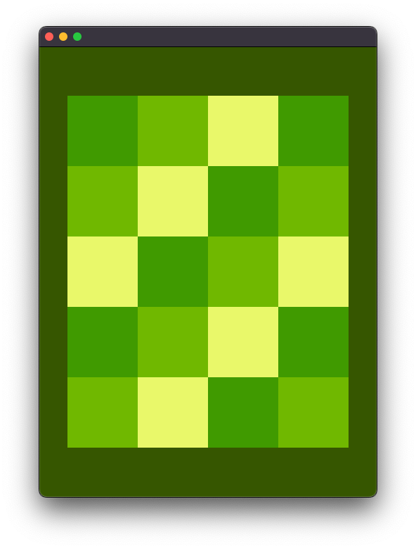
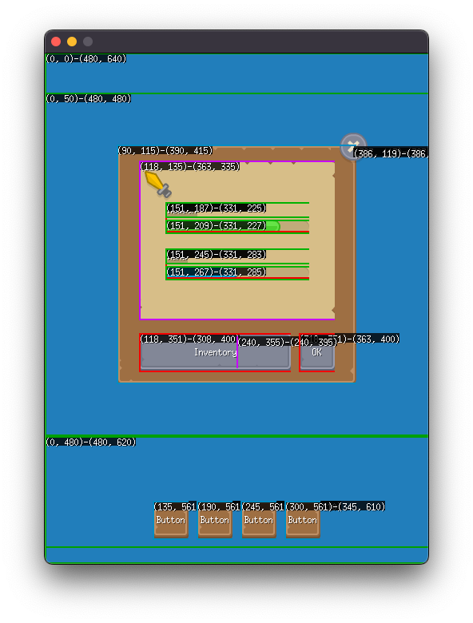

<h1>Furex</h1>

Furex is a minimal GUI framework built on top of [Ebitengine](https://ebiten.org/), a 2D game engine for Go. It provides support for the [Flex Layout Algorithm](https://www.w3.org/TR/css-flexbox-1/#layout-algorithm), a powerful tool for laying out items of different sizes and dimensions. Furex is not a component library, but rather a framework for positioning and stacking virtual widgets, handling button and touch events for mobile, and more. How these widgets are rendered is up to the user.

<p align="center">
  
</p>

Assets by [Kenney](https://kenney.nl). Fonts by [00ff](http://www17.plala.or.jp/xxxxxxx/00ff/).

Full source code of the example is [here](examples/game/main.go).

## Contents

- [Contents](#contents)
- [Motivation](#motivation)
- [Features](#features)
- [Getting Started](#getting-started)
- [Basic Usage](#basic-usage)
- [Building UI with HTML](#building-ui-with-html)
  - [CSS Properties](#css-properties)
  - [HTML Attributes](#html-attributes)
  - [Component Types](#component-types)
  - [Global Components](#global-components)
- [Debugging](#debugging)
- [Contributions](#contributions)

## Motivation

[Flexbox](https://www.w3.org/TR/css-flexbox/) is a popular layout mechanism in web development, used for creating responsive and flexible user interfaces. With Furex, we can bring this same concept to game development using Go and Ebitengine. This library aims to make it easier for developers with experience in web or React projects to create dynamic, user-friendly game UI.

If you are not familiar with Flexbox Layout, you can learn about it at this [website](https://flexboxfroggy.com/).

## Features

Here are some of the key features of Furex:

- Flexbox layout: The UI layout can be configured using the properties of [View](https://pkg.go.dev/github.com/yohamta/furex/v2#View) instances, which can be thought of as equivalent to `DIV` elements in HTML. These views can be stacked or nested to create complex layouts.

- Custom widgets: `View` instances can receive a `Handler` which is responsible for drawing and updating the view. This allows users to create any type of UI component by implementing the appropriate handler interfaces, such as [Drawer](https://pkg.go.dev/github.com/yohamta/furex/v2#Drawer), [Updater](https://pkg.go.dev/github.com/yohamta/furex/v2#Updater), and more.

- Button support: To create a button, users can implement the [ButtonHandler](https://pkg.go.dev/github.com/yohamta/furex/v2#ButtonHandler) interface. This supports both touch and mouse input for button actions. See the [Example Button](./examples/game/widgets/button.go) for more details.

- Touch and mouse events: Furex provides support for handling touch events and positions using the [TouchHandler](https://pkg.go.dev/github.com/yohamta/furex/v2#TouchHandler) interface, and mouse click events using the [MouseLeftButtonHandler](https://pkg.go.dev/github.com/yohamta/furex/v2#MouseLeftButtonHandler) interface. It also offers support for detecting mouse position events using the [MouseHandler](https://pkg.go.dev/github.com/yohamta/furex/v2#MouseHandler) interface, and mouse enter/leave events using the [MouseEnterLeaveHandler](https://pkg.go.dev/github.com/yohamta/furex/v2#MouseEnterLeaveHandler) interface.

- Swipe gestures: Users can detect swipe gestures by implementing the [SwipeHandler](https://pkg.go.dev/github.com/yohamta/furex/v2#SwipeHandler) interface.

These are just a few examples of the capabilities of Furex. For more information, be sure to check out the [GoDoc](https://pkg.go.dev/github.com/yohamta/furex/v2) documentation.

## Getting Started

To get started with Furex, install Furex using the following command:

```sh
go get github.com/yohamta/furex/v2
```

## Basic Usage

Here's a simple example of how to use Furex to create an UI in your game:

[Full source code of the example](examples/simple/main.go)

```go
type Game struct {
  initOnce sync.Once
  screen   screen
  gameUI   *furex.View
}

func (g *Game) Update() error {
  g.initOnce.Do(func() {
    g.setupUI()
  })
  return nil
}

func (g *Game) Draw(screen *ebiten.Image) {
  g.gameUI.Draw(screen)
}

func (g *Game) setupUI() {
  screen.Fill(color.RGBA{0x3d, 0x55, 0x0c, 0xff})
  colors := []color.Color{
    color.RGBA{0x3d, 0x55, 0x0c, 0xff},
    color.RGBA{0x81, 0xb6, 0x22, 0xff},
    color.RGBA{0xec, 0xf8, 0x7f, 0xff},
  }

  g.gameUI = &furex.View{
    Width:        g.screen.Width,
    Height:       g.screen.Height,
    Direction:    furex.Row,
    Justify:      furex.JustifyCenter,
    AlignItems:   furex.AlignItemCenter,
    AlignContent: furex.AlignContentCenter,
    Wrap:         furex.Wrap,
  }

  for i := 0; i < 20; i++ {
    g.gameUI.AddChild(&furex.View{
      Width:  100,
      Height: 100,
      Handler: &Box{
        Color: colors[i%len(colors)],
      },
    })
  }
}

type Box struct {
  Color color.Color
}

var _ furex.Drawer = (*Box)(nil)

func (b *Box) Draw(screen *ebiten.Image, frame image.Rectangle, view *furex.View) {
  graphic.FillRect(screen, &graphic.FillRectOpts{
    Rect: frame, Color: b.Color,
  })
}
```

<p align="center">
  
</p>

## Building UI with HTML

Sometimes making a complex UI tree in Go can be cumbersome. You can use HTML to construct the UI tree more easily.

Here's how to create a view tree from HTML:

- ui.html
  ```html
  <html>
    <head>
      <style>
        container {
          align-items: center;
          justify-content: center;
        }
        .sprite {
          width: 64px;
          height: 64px;
        }
      </style>
    </head>
    <body>
      <container>
        <character class="sprite"></character>
      </container>
    </body>
  </html>
  ```

- ui.go

  ```go
  //go:embed assets/html/ui.html
  var html string

  view := furex.Parse(html, &furex.ParseOptions{
    Width: 480,
    Height: 600,
    Components: map[string]furex.Component{
      "character": &widgets.Sprite{SpriteID: "mario.png"},
    },
  })
  ```

  Note: The `<body>` tag itself won't be converted as a `View`, but its children will be converted to `View` instances.

This example is equivalent to the following Go code. By using HTML for styling the UI, the code becomes more maintainable.

```go
view := (&furex.View{
  Width: 480,
  Height: 600,
  AlignItems: furex.AlignItemsCenter,
  Justify: furex.JustifyCenter,
}).AddChild(
  &furex.View{
    Width: 64,
    Height: 64,
    Handler: &widgets.Sprite{SpriteID: "mario.png"},
  },
)
```

For a more extensive example, check out the [example here](examples/game/main.go) and the embedded [HTML file](examples/game/assets/html/main.html).

### CSS Properties

The following table lists the available CSS properties:

| CSS Property | Type         | Available Values          |
| -------------- | ------------ | ------------------------- |
| `left`         | int          | Any integer value         |
| `right`        | int          | Any integer value         |
| `top`          | int          | Any integer value         |
| `bottom`       | int          | Any integer value         |
| `width`        | int          | Any integer value or percentage |
| `height`       | int          | Any integer value or percentage |
| `margin-left`  | int          | Any integer value         |
| `margin-top`   | int          | Any integer value         |
| `margin-right` | int          | Any integer value         |
| `margin-bottom`| int          | Any integer value         |
| `position`     | Position     | `static`, `absolute`      |
| `flex-direction` | Direction    | `row`, `column`           |
| `flex-wrap`    | FlexWrap     | `no-wrap`, `wrap`, `wrap-reverse` |
| `justify-content` | Justify      | `flex-start`, `flex-end`, `center`, `space-between`, `space-around` |
| `align-items`  | AlignItem    | `stretch`, `flex-start`, `flex-end`, `center` |
| `align-content`| AlignContent | `flex-start`, `flex-end`, `center`, `space-between`, `space-around`, `stretch` |
| `flex-grow`    | float64      | Any float64 value         |
| `flex-shrink`  | float64      | Any float64 value         |
| `display`      | Display      | `flex`, `none`            |

### HTML Attributes

The following table lists the available HTML attributes:

| HTML Attribute | Type               | Available Values          |
| -------------- | ------------------ | ------------------------- |
| `id`           | string             | Any string value          |
| `hidden`       | bool               | `true`, `false`           |

### Component Types

There are three types of components you can create in Furex:

- **Handler Instance**: A `furex.Handler` instance, such as `Drawer` or `Updater`.
- **Factory Function**: A function that returns a `furex.Handler` instance. This is useful when you want to create separate handler instances for each HTML tag.
- **Function Component**: A function that returns a `*furex.View` instance. This is an alternative way to create components that encapsulate their own behavior and styles.

### Global Components

To register a custom component globally, use the furex.RegisterComponents function. For example:

```go
  func init() {
  	furex.RegisterComponents(furex.ComponentsMap{
  		"button":  &widgets.Button{},
  		"sprite": &widgets.Sprite{},
  	})
  }
```
## Debugging

You can enable Debug Mode by setting the variable below.

```go
furex.Debug = true
```

<p align="center">
  
</p>

## Contributions

Contributions are welcome! If you find a bug or have an idea for a new feature, feel free to open an issue or submit a pull request.

